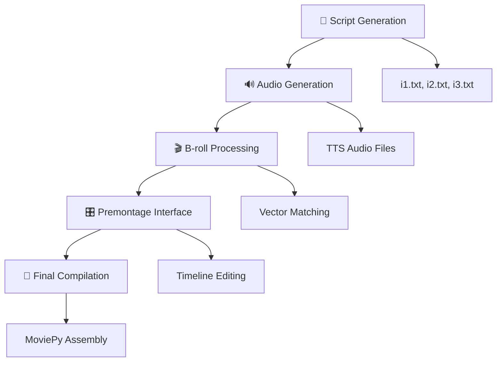
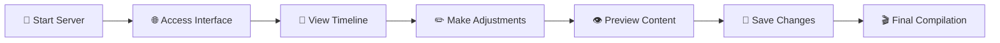

# 🎬 Premontage System Documentation

> **A comprehensive guide to the video premontage system for new developers**

## 📋 Overview

The **premontage system** is a sophisticated web-based interface that provides visual preview and editing capabilities for video projects before final compilation. It enables users to visualize how B-roll videos synchronize with audio content and make precise timing adjustments through an intuitive interface.

## 🛠️ Key Technologies & Dependencies

| Technology | Purpose | Version |
|------------|---------|---------|
| **FastAPI** | Web framework for backend APIs | Latest |
| **WebSockets** | Real-time communication between frontend and backend | - |
| **Uvicorn** | ASGI server for running FastAPI applications | - |
| **Python** | Core runtime environment | 3.12+ |
| **HTML/CSS/JavaScript** | Frontend interface | ES6+ |
| **MoviePy** | Video processing and editing | Latest |
| **OpenAI API** | Text-to-speech generation | - |
| **SentenceTransformers** | B-roll matching with embeddings | Latest |

## 📁 File Structure

The premontage system is organized around these essential components:

```
src/premontage/
├── server.py                     # 🖥️ Premontage interface backend
└── ...

b-roll/
├── [video_files].mp4             # 🎥 B-roll video content
└── metadata/                     # 📊 Video metadata storage

projects/{project}/
├── temp/
│   ├── broll_timing.json         # ⏱️ B-roll synchronization data
│   └── audio/                    # 🔊 Generated TTS audio files
└── ...
```
## ⚙️ How It Works

### 🚀 Step 1: Project Setup
The system operates with video projects containing:
- **Script files**: `i1.txt`, `i2.txt`, `i3.txt`
- **Audio files**: Generated from text-to-speech
- **B-roll timing data**: Precise synchronization metadata
- **Temporary directory**: Processed content storage

### 📹 Step 2: B-roll Processing
The system processes `broll_timing.json` containing:
- ⏰ **Precise timing data** for B-roll videos
- 📝 **Bullet point associations** from script content
- 🎯 **Metadata mapping** for each video segment
- 🔗 **Start/end time coordinates** for synchronization

### 📊 Step 3: Visual Timeline
The premontage interface creates an interactive timeline featuring:

| Component | Description |
|-----------|-------------|
| 🎵 **Audio Segments** | TTS-generated audio tracks |
| 🎬 **B-roll Thumbnails** | Video segment previews |
| 🔄 **Sync Points** | Audio-video alignment markers |
| ⏱️ **Duration Display** | Timing information overlay |
| 🖱️ **Drag & Drop** | Interactive editing capabilities |

### 🔄 Step 4: Real-time Updates
WebSocket connections provide:
- 📡 **Live progress updates** during processing
- 📜 **Real-time logging** with color-coded messages
- 📊 **Status monitoring** for each pipeline step
- ⚡ **Instant feedback** on user interactions
## 🔗 Integration with Main Pipeline

The premontage system seamlessly integrates with the main video generation pipeline:



### Pipeline Steps:

1. **📝 Script Generation** → Creates structured script files
2. **🔊 Audio Generation** → TTS processes each script segment
3. **🎬 B-roll Processing** → Vector matching finds appropriate videos
4. **🎛️ Premontage** → Web interface for timeline editing
5. **🎥 Final Compilation** → MoviePy assembles the final video
## 🏗️ Technical Implementation

### 🖥️ Backend (FastAPI)

| Feature | Description |
|---------|-------------|
| **REST API** | Comprehensive endpoints for project management |
| **WebSocket Support** | Real-time bidirectional communication |
| **CLI Integration** | Seamless integration with existing commands |
| **Authentication** | Configurable security via `config.yml` |

### 🌐 Frontend (HTML/JavaScript)

| Component | Technology | Purpose |
|-----------|------------|---------|
| **UI Framework** | Modern HTML5/CSS3 | Responsive interface design |
| **Real-time Console** | WebSocket + JavaScript | Live log streaming |
| **Timeline Editor** | Custom JS Components | Interactive timeline manipulation |
| **Process Monitor** | AJAX + WebSocket | Task status monitoring |

### ⚙️ Configuration

The system uses `config.yml` for centralized configuration:

```yaml
# Example configuration structure
authentication:
  enabled: true/false
  type: "basic_auth"

server:
  host: "localhost"
  port: 47393

paths:
  projects: "./projects"
  b_roll: "./b-roll"

processing:
  audio:
    format: "wav"
    sample_rate: 44100
  video:
    resolution: "1920x1080"
    fps: 30
```
## ✨ Key Features

### 🚀 Core Capabilities

| Feature | Description | Benefit |
|---------|-------------|---------|
| **⚡ Real-time Processing** | Live updates during video generation | Immediate feedback and monitoring |
| **🎛️ Timeline Editing** | Visual timeline with drag-and-drop | Intuitive content manipulation |
| **🔄 B-roll Synchronization** | Precise timing control for video segments | Perfect audio-video alignment |
| **🛡️ Error Handling** | Comprehensive error reporting and recovery | Robust and reliable operation |
| **🎮 Process Control** | Start/stop/kill operations for tasks | Complete workflow management |
| **📊 Advanced Logging** | Detailed logs with color-coded messages | Enhanced debugging and monitoring |
| **🔐 Authentication** | Optional HTTP Basic Auth security | Configurable access control |

### 🎯 Advanced Features

- **🔍 Preview Mode**: Real-time preview of synchronized content
- **💾 Auto-save**: Automatic saving of timeline modifications
- **📱 Responsive Design**: Mobile-friendly interface
- **🌙 Dark/Light Mode**: Customizable UI themes
- **⚡ Hot Reload**: Instant updates without page refresh
## 🚀 Usage Workflow

### Step-by-Step Process



### Detailed Steps:

| Step | Action | Details |
|------|--------|---------|
| **1** | 🚀 **Start Server** | Launch premontage server for specific project |
| **2** | 🌐 **Access Interface** | Open web interface on `http://localhost:47393` |
| **3** | 👀 **View Timeline** | Examine visual timeline with audio and B-roll segments |
| **4** | ✏️ **Adjust Timing** | Use drag-and-drop interface for fine-tuning |
| **5** | 👁️ **Preview Content** | Real-time preview of synchronized content |
| **6** | 💾 **Save Changes** | Persist timeline modifications |
| **7** | 🎬 **Compile** | Proceed to final video compilation |

---

## 🎯 Summary

The **premontage system** provides a specialized web-based interface for timeline editing and B-roll synchronization, making it effortless to fine-tune video content before final compilation. This powerful tool bridges the gap between automated content generation and manual creative control.

### 🔑 Key Benefits:
- **🎨 Creative Control**: Fine-tune timing and synchronization
- **👁️ Visual Feedback**: See changes in real-time
- **⚡ Efficiency**: Streamlined workflow integration  
- **🛡️ Reliability**: Robust error handling and recovery
- **🔧 Flexibility**: Configurable to project needs

> **💡 Pro Tip**: Use the premontage system to perfect your video timing before final rendering to save processing time and achieve professional results!