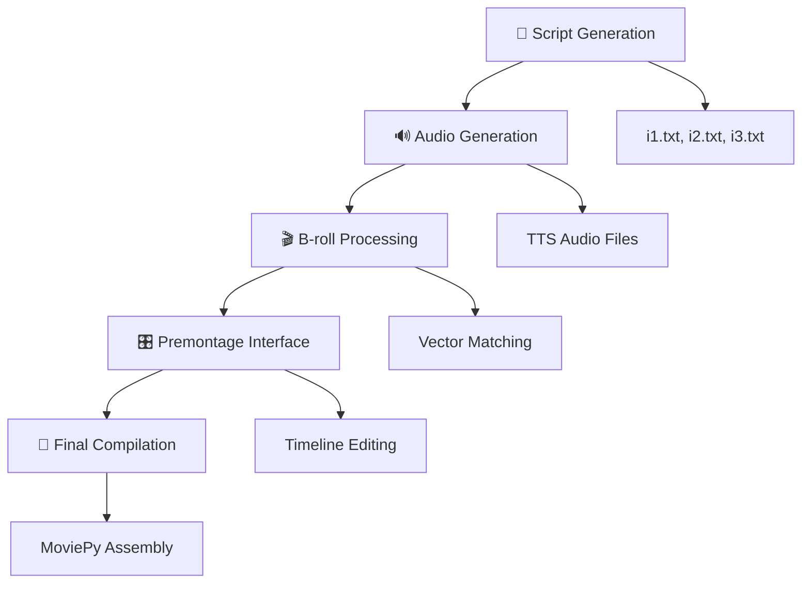
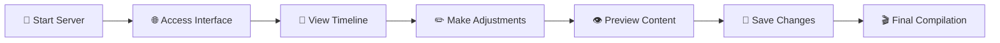

# 🎬 StoryForge Premontage System Documentation

> **A comprehensive guide to the FastAPI-based premontage system for new developers**

## 📋 Overview

The **premontage system** is a sophisticated FastAPI-based web interface that provides visual preview and editing capabilities for video projects before final compilation. It enables users to visualize how B-roll videos synchronize with audio content and make precise timing adjustments through an intuitive interface with real-time WebSocket communication.

## 🚀 Quick Start

### Installation

1. **Install dependencies:**
   ```bash
   cd backend
   pip install -r requirements.txt
   ```

2. **Run the server:**
   ```bash
   python run.py
   ```

3. **Access the interface:**
   - Main interface: http://localhost:47393
   - API documentation: http://localhost:47393/docs
   - Alternative docs: http://localhost:47393/redoc

## 🛠️ Key Technologies & Dependencies

| Technology | Purpose | Version |
|------------|---------|---------|
| **FastAPI** | Web framework for backend APIs | Latest |
| **WebSockets** | Real-time communication between frontend and backend | - |
| **Uvicorn** | ASGI server for running FastAPI applications | - |
| **Python** | Core runtime environment | 3.12+ |
| **HTML/CSS/JavaScript** | Frontend interface | ES6+ |
| **MoviePy** | Video processing and editing | Latest |
| **OpenAI API** | Text-to-speech generation | - |
| **SentenceTransformers** | B-roll matching with embeddings | Latest |

## 📁 File Structure

The premontage system is organized around these essential components:

```
backend/
├── main.py                    # FastAPI application entry point
├── run.py                     # Server startup script with CLI options
├── requirements.txt           # Python dependencies
├── start.sh                   # Simple bash startup script
├── auth/                      # Authentication middleware
│   ├── __init__.py
│   └── middleware.py
├── config/                    # Configuration management
│   ├── __init__.py
│   └── settings.py
├── models/                    # Pydantic models and schemas
│   ├── __init__.py
│   └── schemas.py
├── routes/                    # API route handlers
│   ├── __init__.py
│   └── api.py
├── websocket/                 # WebSocket handlers
│   ├── __init__.py
│   └── handler.py
├── legacy_server/             # Legacy HTTP server (reference)
│   ├── server.py
│   └── interface.html
└── static/                    # Static files (HTML interface)
    └── interface.html

b-roll/
├── [video_files].mp4          # 🎥 B-roll video content
├── metadata/                  # 📊 Video metadata storage
└── ressources/                # 📁 Uploaded overlay images

projects/{project}/
├── temp/
│   ├── broll_timing.json      # ⏱️ B-roll synchronization data
│   └── audio/                 # 🔊 Generated TTS audio files
└── ...
```
## ⚙️ How It Works

### 🚀 Step 1: Project Setup
The system operates with video projects containing:
- **Script files**: `i1.txt`, `i2.txt`, `i3.txt`
- **Audio files**: Generated from text-to-speech
- **B-roll timing data**: Precise synchronization metadata
- **Temporary directory**: Processed content storage

### 📹 Step 2: B-roll Processing
The system processes `broll_timing.json` containing:
- ⏰ **Precise timing data** for B-roll videos
- 📝 **Bullet point associations** from script content
- 🎯 **Metadata mapping** for each video segment
- 🔗 **Start/end time coordinates** for synchronization

### 📊 Step 3: Visual Timeline
The premontage interface creates an interactive timeline featuring:

| Component | Description |
|-----------|-------------|
| 🎵 **Audio Segments** | TTS-generated audio tracks |
| 🎬 **B-roll Thumbnails** | Video segment previews |
| 🔄 **Sync Points** | Audio-video alignment markers |
| ⏱️ **Duration Display** | Timing information overlay |
| 🖱️ **Drag & Drop** | Interactive editing capabilities |

### 🔄 Step 4: Real-time Updates
WebSocket connections provide:
- 📡 **Live progress updates** during processing
- 📜 **Real-time logging** with color-coded messages
- 📊 **Status monitoring** for each pipeline step
- ⚡ **Instant feedback** on user interactions
## 🔗 Integration with Main Pipeline

The premontage system seamlessly integrates with the main video generation pipeline:



### Pipeline Steps:

1. **📝 Script Generation** → Creates structured script files
2. **🔊 Audio Generation** → TTS processes each script segment
3. **🎬 B-roll Processing** → Vector matching finds appropriate videos
4. **🎛️ Premontage** → Web interface for timeline editing
5. **🎥 Final Compilation** → MoviePy assembles the final video
## 🏗️ Technical Implementation

### 🖥️ Backend (FastAPI)

| Feature | Description |
|---------|-------------|
| **REST API** | Comprehensive endpoints for project management |
| **WebSocket Support** | Real-time bidirectional communication |
| **CLI Integration** | Seamless integration with existing commands |
| **Authentication** | Configurable security via `config.yml` |

### 🔌 API Endpoints

#### Timeline Management
- `GET /api/timeline` - Get current timeline data
- `POST /api/timeline` - Update timeline data
- `GET /api/project-info` - Get project information
- `GET /api/status` - Get system status

#### File Operations
- `POST /api/upload` - Upload overlay images
- `DELETE /api/upload/{filename}` - Delete uploaded files
- `GET /b-roll/{file_path}` - Serve B-roll files
- `GET /projects/{file_path}` - Serve project files

#### WebSocket
- `WS /ws` - Real-time communication for logs, progress updates, and notifications

#### System
- `GET /health` - Health check endpoint
- `GET /` - Main HTML interface

### 🌐 WebSocket Communication

The WebSocket endpoint provides real-time communication with several message types:

#### Client → Server Messages
```json
{
  "type": "ping",
  "data": {}
}
```

#### Server → Client Messages
```json
{
  "type": "log",
  "level": "info",
  "message": "Processing started",
  "timestamp": "2024-01-01T12:00:00",
  "details": {}
}
```

Message types:
- `log` - Log messages with different levels
- `progress` - Processing progress updates
- `notification` - System notifications
- `timeline_update` - Timeline data changes
- `pong` - Response to ping messages

### 🌐 Frontend (HTML/JavaScript)

| Component | Technology | Purpose |
|-----------|------------|---------|
| **UI Framework** | Modern HTML5/CSS3 | Responsive interface design |
| **Real-time Console** | WebSocket + JavaScript | Live log streaming |
| **Timeline Editor** | Custom JS Components | Interactive timeline manipulation |
| **Process Monitor** | AJAX + WebSocket | Task status monitoring |

### ⚙️ Configuration

The system uses `config.yml` for centralized configuration:

```yaml
# Authentication (optional)
dashboard:
  auth:
    enabled: false
    username: "admin" 
    password: "admin"

# Server settings
server:
  host: "0.0.0.0"
  port: 47393
  reload: false

# File paths
paths:
  projects: "./projects"
  b_roll: "./b-roll"
  temp: "./temp"

# Processing settings
processing:
  audio:
    format: "wav"
    sample_rate: 44100
  video:
    resolution: "1920x1080"
    fps: 30
```

### 🔐 Authentication

HTTP Basic Authentication is configurable via `config.yml`:

```yaml
dashboard:
  auth:
    enabled: true
    username: "your_username"
    password: "your_password"
```

When enabled, all endpoints require authentication except `/health`.
## ✨ Key Features

### 🚀 Core Capabilities

| Feature | Description | Benefit |
|---------|-------------|---------|
| **⚡ Real-time Processing** | Live updates during video generation | Immediate feedback and monitoring |
| **🎛️ Timeline Editing** | Visual timeline with drag-and-drop | Intuitive content manipulation |
| **🔄 B-roll Synchronization** | Precise timing control for video segments | Perfect audio-video alignment |
| **🛡️ Error Handling** | Comprehensive error reporting and recovery | Robust and reliable operation |
| **🎮 Process Control** | Start/stop/kill operations for tasks | Complete workflow management |
| **📊 Advanced Logging** | Detailed logs with color-coded messages | Enhanced debugging and monitoring |
| **🔐 Authentication** | Optional HTTP Basic Auth security | Configurable access control |

### 🎯 Advanced Features

- **🔍 Preview Mode**: Real-time preview of synchronized content
- **💾 Auto-save**: Automatic saving of timeline modifications
- **📱 Responsive Design**: Mobile-friendly interface
- **🌙 Dark/Light Mode**: Customizable UI themes
- **⚡ Hot Reload**: Instant updates without page refresh
## 🚀 Usage Workflow

### Running the Server

#### Basic Usage
```bash
python run.py
```

#### Development Mode
```bash
python run.py --reload --log-level debug
```

#### Custom Host/Port
```bash
python run.py --host 0.0.0.0 --port 8080
```

#### Project-Specific Mode
```bash
python run.py --project my-project-06
```

#### Command Line Options
```
--host HOST              Host to bind server to
--port PORT              Port to bind server to  
--reload                 Enable auto-reload for development
--project PROJECT        Specify project name for temp path
--log-level LEVEL        Set logging level (debug/info/warning/error)
--validate-only          Only validate configuration and exit
```

### Step-by-Step Process



### Detailed Steps:

| Step | Action | Details |
|------|--------|---------|
| **1** | 🚀 **Start Server** | Launch premontage server: `python run.py` |
| **2** | 🌐 **Access Interface** | Open web interface on `http://localhost:47393` |
| **3** | 👀 **View Timeline** | Examine visual timeline with audio and B-roll segments |
| **4** | ✏️ **Adjust Timing** | Use drag-and-drop interface for fine-tuning |
| **5** | 👁️ **Preview Content** | Real-time preview of synchronized content |
| **6** | 💾 **Save Changes** | Persist timeline modifications |
| **7** | 🎬 **Compile** | Proceed to final video compilation |

## 📊 Data Models

### Timeline Item
```json
{
  "start_time": 0.0,
  "end_time": 5.0,
  "duration": 5.0,
  "broll_path": "b-roll/video.mp4",
  "bullet_point": "Introduction text",
  "similarity_score": 0.85,
  "image": "ressources/overlay.png",
  "metadata": {}
}
```

### Upload Response
```json
{
  "success": true,
  "message": "File uploaded successfully",
  "file_path": "ressources/uploaded_image.png",
  "file_size": 12345
}
```

## 🔄 Integration with Legacy System

This FastAPI backend is designed to replace the legacy HTTP server while maintaining compatibility:

### Migrated Features
- ✅ HTTP Basic Authentication from config.yml
- ✅ Timeline data serving (`/api/timeline`)
- ✅ File upload handling (`/api/upload`)
- ✅ Static file serving (B-roll and project files)
- ✅ Project-specific temp path handling

### Enhanced Features
- 🆕 Modern FastAPI framework with automatic API documentation
- 🆕 WebSocket support for real-time communication
- 🆕 Structured logging and error handling
- 🆕 Pydantic models for data validation
- 🆕 Health check endpoint
- 🆕 Configuration validation
- 🆕 CLI with multiple options

### Compatibility
The new backend serves the same endpoints as the legacy server, ensuring frontend compatibility while providing enhanced functionality.

## 🧪 Development

### Installing Development Dependencies
```bash
pip install -r requirements.txt
```

### Running Tests
```bash
pytest
```

### Code Style
The project follows Python best practices:
- Type hints throughout
- Pydantic models for data validation
- Structured logging
- Error handling with proper HTTP status codes

## 🚨 Troubleshooting

### Common Issues

1. **Port already in use:**
   ```bash
   python run.py --port 8080
   ```

2. **Config file not found:**
   - Ensure `config.yml` exists in the project root
   - Use `--validate-only` to check configuration

3. **broll_timing.json missing:**
   - Run B-roll processing first: `python -m b_roll.cli extract-metadata`
   - The timeline API requires this file to exist

4. **Authentication issues:**
   - Check credentials in `config.yml`
   - Disable auth temporarily: set `dashboard.auth.enabled: false`

### Logs
Server logs are written to both console and `premontage.log` file.

---

## 🎯 Summary

The **StoryForge premontage system** provides a modern FastAPI-based web interface for timeline editing and B-roll synchronization, making it effortless to fine-tune video content before final compilation. This powerful tool bridges the gap between automated content generation and manual creative control with real-time WebSocket communication and comprehensive API documentation.

### 🔑 Key Benefits:
- **🎨 Creative Control**: Fine-tune timing and synchronization with drag-and-drop interface
- **👁️ Visual Feedback**: See changes in real-time with WebSocket updates
- **⚡ Efficiency**: Streamlined workflow integration with CLI options
- **🛡️ Reliability**: Robust error handling and comprehensive logging
- **🔧 Flexibility**: Configurable authentication and paths via `config.yml`
- **📚 Documentation**: Automatic API documentation at `/docs` and `/redoc`
- **🔌 Modern API**: RESTful endpoints with Pydantic validation

### 🚀 Quick Access:
- **Main Interface**: http://localhost:47393
- **API Documentation**: http://localhost:47393/docs
- **Health Check**: http://localhost:47393/health
- **Start Command**: `python run.py`

> **💡 Pro Tip**: Use the premontage system with `--reload` flag during development to perfect your video timing with automatic server reloading, and access the comprehensive API documentation to understand all available endpoints!